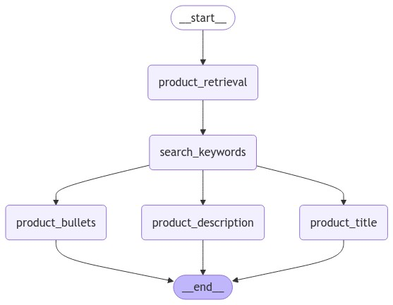
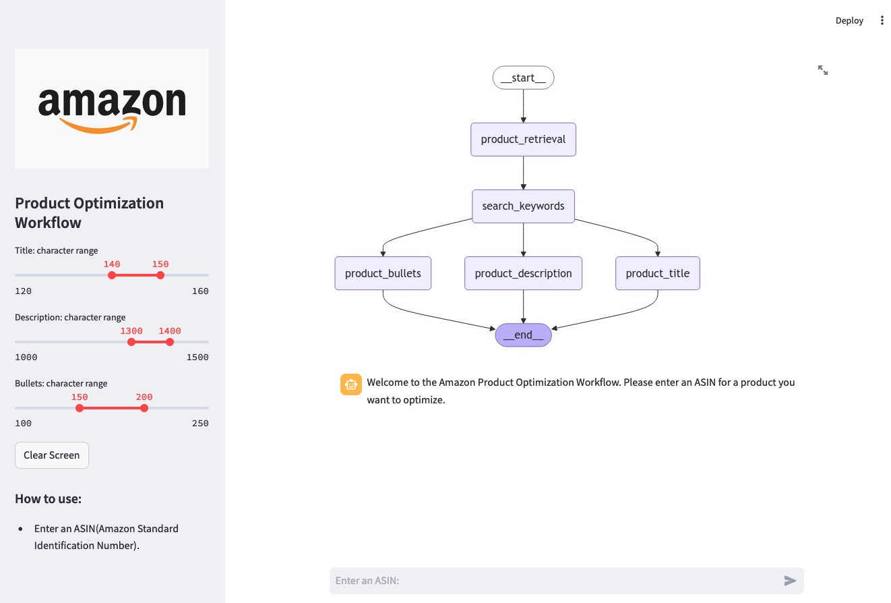

# Product Description Optimization - Agentic Workflow


## Description

The Product Description Optimization workflow is designed to assist customers in enhancing their product listings by refining key content areas based on an input ASIN (Amazon Standard Identification Number).
This workflow prototype begins by receiving an ASIN for the product to be optimized.
Once the ASIN is entered, the process follows these steps:

- Retrieve product information from Amazon.com using the ASIN
- Generate search keywords
- Optimize product bullets
- Optimize product description
- Optimize product title

Customers can adjust their target character ranges for the title, description, and bullets to meet their specific needs.
The final step of the workflow involves a human-in-the-loop review, ensuring the optimized content meets quality standards before implementation.

## LangGraph - Workflow



## Demo



### Streamlit App

```
pip install -r requirements.txt

streamlit run main.py
```